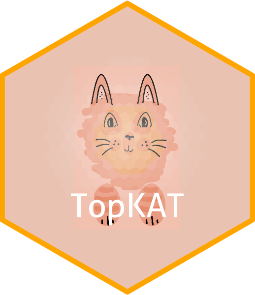

# TopKAT: Topological Kernel Association Test 

TopKAT is a global test of association between the topological (geometric) structure of cells in cell-level imaging data and patient-level outcomes. 
The goal of the `TopKAT` package is to provide the software to run this test and do post-hoc analyses of the results. 

## Installation

You can install the development version of `TopKAT` from Github via:
```
# First, install devtools
if (!require("devtools", quietly = TRUE)) {
  install.packages("devtools")
}

# Install from Github
devtools::install_github("sarahsamorodnitsky/TopKAT")
```
`TopKAT` relies on several dependencies: `MiRKAT`, `RcppAlgos`, `TDAstats`, `dplyr`, `ggplot2`, `ggtda`, `reshape2`, `tidyr`, `viridis`, `igraph`, and `magrittr`. The underlying engine for running persistent homology is `TDAstats`. `ggtda`, which facilitates visualization of the filtration process and persistence diagrams is available only on Github. 

## Vignettes

Example usage of `TopKAT` to analyze data is provided in two vignetes:

1. `Getting Started`: illustrates the application of TopKAT to a simulated dataset containing contrived shapes.
2. `Simulated Tissue`: illustrates the application of TopKAT to a dataset simulated using the `scSpatialSIM` package. 
